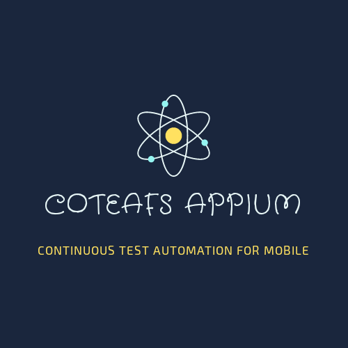
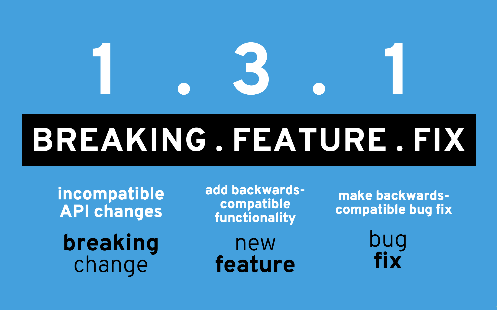

<p align="center">
  <a href="https://wasiqb.github.io/projects/appium/to">
    
  </a>
</p>

<h1 align="center">Wrapper Appium Framework which supports Automation of Mobile and Tablet apps for Android and iOS Real Devices / Emulators.</h1>

<div align="center">

> **Note:** Documentation site is under updation. Although some part of documentation is ready.
> Checkout this space to know when the documentation is ready.

[][home]
[][circleci]
[](http://isitmaintained.com/project/WasiqB/Coteafs-Appium "Average time to resolve an issue")
[](https://sonarcloud.io/project/issues?id=com.github.wasiqb.coteafs%3Aappium&resolved=false)
[](https://sonarcloud.io/component_measures?id=com.github.wasiqb.coteafs%3Aappium&metric=Coverage)
[](https://sonarcloud.io/dashboard?id=com.github.wasiqb.coteafs%3Aappium)
[](https://sonarcloud.io/component_measures?id=com.github.wasiqb.coteafs%3Aappium&metric=Maintainability)
[](https://sonarcloud.io/component_measures?id=com.github.wasiqb.coteafs%3Aappium&metric=Reliability)
[](https://sonarcloud.io/component_measures?id=com.github.wasiqb.coteafs%3Aappium&metric=Security)
[](https://sonarcloud.io/component_measures?id=com.github.wasiqb.coteafs%3Aappium&metric=new_vulnerabilities)
[](https://sonarcloud.io/component_measures?id=com.github.wasiqb.coteafs%3Aappium&metric=Duplications)
[][maven]
[](https://github.com/WasiqB/coteafs-appium/releases)

</div>

<p align="center">
  
</p>

## :rocket: [Quick Start][wiki]
* The [documentations][wiki] of coteafs-appium includes all the information you need to get started including setup, usage, advantages, sample test.
* To know what changes are Released, check out the [change log][] for complete list of changes.
* Want to know when our next feature or fix release is going to happen? Watch out our planned [milestones][].

## :factory: [How to configure the tests?][config-doc]

First step in writing tests using coteafs-appium framework is defining a Yaml config file in the `src/test/resources` folder.

**(_For more details, check the link above._)**

Sample file is shown below.

```yaml
servers:
  android:
    host: 127.0.0.1
    port: 4723
    external: true
    arguments:
      log_level: DEBUG
      log_time_stamp: true
      local_time_zone: true
      session_override: true
      android:
        suppress_adb_kill_server: true
devices:
  test:
    platform_type: ANDROID
    device_name: MI Redmi Note 4
    device_version: 7.0
    app_type: HYBRID
    device_type: REAL
    automation_name: APPIUM
    app_location: apps/android/VodQA.apk
    session_timeout: 120000
    playback:
      delay_before_swipe: 200
      delay_after_swipe: 100
      delay_before_tap: 0
      delay_after_tap: 0
```

## :dart: [How simple it is to write the tests?][test-doc]

By using Action classes for each Activity, the flow specific for that activity can be modularized and tests looks much clean and readable.
See the sample test below.

```java
import org.testng.annotations.AfterClass;
import org.testng.annotations.AfterMethod;
import org.testng.annotations.BeforeClass;
import org.testng.annotations.BeforeMethod;

import com.github.wasiqb.coteafs.appium.android.vodqa.actions.LoginActivityAction;
import com.github.wasiqb.coteafs.appium.service.AppiumServer;

public class SampleTest {
  protected AndroidDevice androidDevice;
  private AppiumServer androidServer;

  @BeforeClass
  public void setupTestSuite () {
    this.androidServer = new AppiumServer ("android");  // Here the parameter refers to the key in server block in config file.
    this.androidServer.start ();

    this.androidDevice = new AndroidDevice (this.androidServer, "test");  // Here the param refers to the key in devices block in config file.
    this.androidDevice.start ();
  }

  @AfterClass (alwaysRun = true)
  public void tearDownTestSuite () {
    this.androidDevice.stop ();
    this.androidServer.stop ();
  }

  @Test
  public void login () {
    final LoginActivityAction login = new LoginActivityAction (this.androidDevice);
    login.addInputValue ("UserName", "admin")
      .addInputValue ("Password", "admin")
      .perform ();
  }
}
```

## :golf: [How to create Activity class?][activity-doc]

New class needs to be created for each Activity. There's an abstract activity class for each type of device.
Here `prepare` method needs to be implemented with all the elements available on that Activity.

See the below sample for an Android activity with comments for better understanding.

```java
import org.openqa.selenium.By;

import com.github.wasiqb.coteafs.appium.android.AndroidDevice;
import com.github.wasiqb.coteafs.appium.device.DeviceElement;

public class LoginActivity extends AndroidActivity {
  public LoginActivity (final AndroidDevice device) {
    super (device);
  }

  @Override
  protected DeviceElement prepare () {
    final DeviceElement main = DeviceElement.create ("Main")
      .forAndroid (By.id ("android:id/content"));
    DeviceElement.create ("Back")
      .parent (main)
      .forAndroid (By.xpath ("//android.widget.TextView[@text=\"Back\"]"))
      // We can set multiple locators for different Automation names.
      .forAndroid (AutomationType.UIAUTOMATOR2, MobileBy.AndroidUIAutomator ("new UiSelector ().text (\"Back\");"));
    DeviceElement.create ("UserName")
      .forAndroid (MobileBy.AccessibilityId ("username"))
      .parent (main);
    DeviceElement.create ("Password")
      .forAndroid (MobileBy.AccessibilityId ("password"))
      .parent (main);
    DeviceElement.create ("Login")
      .index (1)    // Index of element when multiple elements for same locator exists.
      .waitStrategy (WaitStrategy.VISIBLE)  // Wait strategy to be used while finding the element.
      .forAndroid (MobileBy.AccessibilityId ("login"))     // Locator used to find the element.
      .parent (main);    // Parent of current element.
    return main;
  }
}
```

## :soccer: [How to create your Activity action class?][action-doc]

There is abstract action class provided by framework where Activity specific flow is implemented in perform method.
See the sample Activity action class below.

```java
import com.github.wasiqb.coteafs.appium.android.AndroidActivityActions;
import com.github.wasiqb.coteafs.appium.android.AndroidDevice;
import com.github.wasiqb.coteafs.appium.android.vodqa.activities.LoginActivity;

public class LoginActivityAction extends AndroidActivityActions {
  public LoginActivityAction (final AndroidDevice device) {
    super (device);
  }

  @Override
  public void perform () {
    final LoginActivity login = new LoginActivity (getDevice ());
    login.onElement ("UserName")
      .enterText (value ("UserName"));
    login.onElement ("Password")
      .enterText (value ("Password"));
    login.onDevice ()
      .hideKeyboard ();
    login.onElement ("Login")
      .tap ();
  }
}
```

## :+1: Liked the framework until now?
### Add dependency to your projects POM.

```xml
<dependency>
  <groupId>com.github.wasiqb.coteafs</groupId>
  <artifactId>appium</artifactId>
  <version>3.0.0</version>
</dependency>
```

## :pushpin: [Want to know Key Features?][intro-doc]
In order to use a framework, it's important to know it's advantages. Let's see what are the key features of this framework:
* :iphone: Supports Android and iOS Real Devices and Emulators.
* :computer: Able to start and stop server on run-time and also can connect to already running server.
* :notebook: Enforces Page object model style of coding.
* :milky_way: Allows parallel and sequential execution of tests.
* :hammer: All capabilities, playback and delay settings are configurable through config file.
* :cloud: Supports execution of tests on any Cloud solution like BrowserStack, SauceLabs, TestingBot, etc.
* :video_camera: Supports video recording of tests on Android and iOS.
* :camera: Supports capturing screenshots for Android and iOS.
* :clipboard: Supports reading Clipboard from devices.
* :notebook_with_decorative_cover: Supports logging of all events occurred during test execution.
* :x: Provides pre-defined errors which wraps the Appium exceptions in a meaningful way.
* :white_check_mark: Provides inbuilt assertions to verify the device elements.
* :hotsprings: Supports any Testing frameworks like TestNG, JUnit or Cucumber.

## :question: What to do when you need help?
* Directly chat with me on my [site][] and I'll revert to you as soon as possible.
* Discuss your queries by writing to us on our [mailing list][]
* If you find any issue which is bottleneck for you, [search the issue tracker][] to see if it is already raised.
* If not raised, then you can create a [new issue][] with required details as mentioned in the issue template.

## :star: What you do if you like the project?
* Spread the word with your network.
* **Star** the project to make the project popular.
* Stay updated with the project progress by **Watching** it.
* Contribute to fix open issues, documentations or add new features. To know more, see our [contributing][] page.

## :heavy_check_mark: Contributors

<div>
  <ul>
    <li>
      <a href="https://github.com/WasiqB">
        
      </a>
    </li>
    <li>
      <a href="https://github.com/mfaisalkhatri">
        
      </a>
    </li>
  </ul>
</div>

## :gift_heart: Thanks for the support.

<p align="left">
  <a href="http://browserstack.com">
    
  </a>
</p>

For allowing us to run our unit tests on different platforms.

## :ticket: Versioning ideology

<p align="left">
  <a href="http://semver.org/">
    
  </a>
</p>

## :copyright: - Wasiq Bhamla

<p align="left">
  <a href="http://www.apache.org/licenses/LICENSE-2.0">
    
  </a>
</p>

[home]: https://github.com/wasiqb/coteafs-appium
[circleci]: https://circleci.com/gh/WasiqB/coteafs-appium
[wiki]: https://wasiqb.github.io/projects/appium/intro/
[site]: https://wasiqb.github.io
[mailing list]: https://groups.google.com/forum/#!forum/coteafs-appium-users
[search the issue tracker]: https://github.com/WasiqB/coteafs-appium/issues?q=something
[new issue]: https://github.com/WasiqB/coteafs-appium/issues/new
[change log]: CHANGELOG.md
[milestones]: https://github.com/WasiqB/coteafs-appium/milestones
[maven]: https://maven-badges.herokuapp.com/maven-central/com.github.wasiqb.coteafs/appium
[contributing]: .github/CONTRIBUTING.md
[config-doc]: https://wasiqb.github.io/coteafs/appium/config-basics/
[test-doc]: https://wasiqb.github.io/coteafs/appium/sample-test-class/
[action-doc]: https://wasiqb.github.io/coteafs/appium/action-class/
[activity-doc]: https://wasiqb.github.io/coteafs/appium/activity-class/
[intro-doc]: https://wasiqb.github.io/coteafs/appium/intro/
