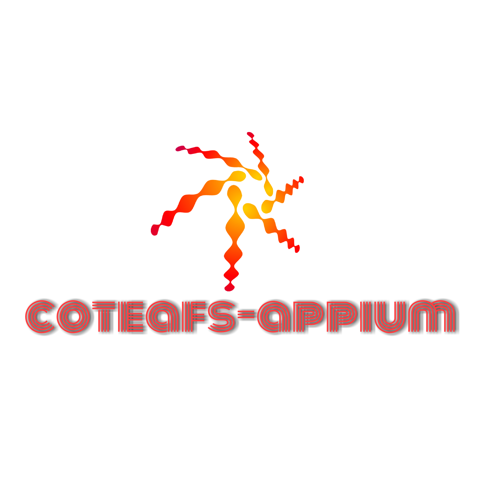

  

A Mobile Automation Framework built on top of [Appium][] which supports testing web and native apps for Android, iOS and Windows Mobiles and Tablets whether real or emulators.

[][maven]

## Why to create yet-another Appium wrapper Framework?
* I couldn't find an easy-to-use framework which had underlying Appium when I started Mobile Automation.
* Also, it was not so easy to identify which capabilities to use for which devices.
* So I came up with this solution for myself and made it open source so everyone can benefit from it.

## Getting Started
* The [wiki][] of coteafs-appium includes all the information you need to get started including setup, usage, advantages, sample test.
* To know what changes are Released, check out the [change log][] for complete list of changes.
* Want to know when our next feature or fix release is going to happen? Watch out our planned [milestones][].

## What to do when you need help?
* **Directly chat with me on my [site][] and I'll revert to you as soon as possible.**
* Discuss your queries by writing to us on our [mailing list][]
* If you find any issue which is bottleneck for you, [search the issue tracker][] to see if it is already raised.
* If not raised, then you can create a [new issue][] with required details as mentioned in the issue template.

## What you do if you like the project?
* Spread the word with your network.
* **Star** the project to make the project popular.
* Stay updated with the project progress by **Watching** it.
* Contribute to fix open issues, documentations or add new features. To know more, see our [contributing][] page.

## Depending coteafs projects
Since **coteafs-appium** is a part of **coteafs** suite, hence it also depends on some of the other coteafs projects:

Name | Description
-----|------------
[coteafs-config][] | Provides support for Yaml file config file.
[coteafs-logger][] | Customizable logger which can be customized by it's config file.
[coteafs-error][] | Custom Error with categorization of errors.
[coteafs-parent][] | Common Parent POM file with build and release configuration.

## Versioning ideology
The project release versioning ideology is adopted from [SemVer][semver].

## Contributors
* [Wasiq Amjad Bhamla][dev]: Framework developer and maintainer
* [Mohammad Faisal Khatri][tester]: Framework Tester

## Thanks

  

For allowing us to run our unit tests on different platforms.

[wiki]: https://wasiqb.github.io/coteafs/appium/intro/
[unit tests]: https://github.com/WasiqB/coteafs-appium/tree/master/src/test
[site]: https://wasiqb.github.io
[mailing list]: https://groups.google.com/forum/#!forum/coteafs-appium-users
[search the issue tracker]: https://github.com/WasiqB/coteafs-appium/issues?q=something
[new issue]: https://github.com/WasiqB/coteafs-appium/issues/new
[coteafs-logger]: https://github.com/WasiqB/coteafs-logger
[coteafs-config]: https://github.com/WasiqB/coteafs-config
[coteafs-error]: https://github.com/WasiqB/coteafs-error
[coteafs-parent]: https://github.com/WasiqB/coteafs-parent
[Appium]: https://github.com/appium/java-client/releases
[change log]: CHANGELOG.md
[milestones]: https://github.com/WasiqB/coteafs-appium/milestones
[semver]: http://semver.org/
[license]: http://www.apache.org/licenses/LICENSE-2.0
[maven]: https://maven-badges.herokuapp.com/maven-central/com.github.wasiqb.coteafs/appium
[dev]: https://github.com/WasiqB/
[tester]: https://github.com/mfaisalkhatri
[contributing]: .github/CONTRIBUTING.md
